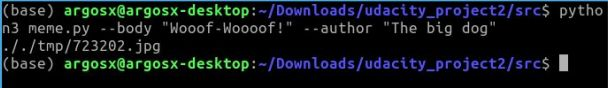

# Meme generator

The goal of this project is to build a "meme generator" – a multimedia application to dynamically generate memes, including an image with an overlaid quote. You can manually copy and paste these quotes into one standard format. The meme generator can be execute in terminal or in a flask server.

Terminal example:


Flask server example:


## Dependencies for Running

* [python >= 3.8.5](https://www.python.org/downloads/)
* [pillow >= 8.0.1](https://pypi.org/project/Pillow/)
* [python-docx >= 0.8.11](https://pypi.org/project/python-doc/)
* [pandas >= 1.1.3](https://pandas.pydata.org/getting_started.html)
* [pdftotext >= 0.86.1](http://www.xpdfreader.com/)
* [flask >= 2.0.1](https://palletsprojects.com/p/flask/)

## Basic Running Instruccions

1. Clone this repo.
2. Open top level directory: `cd ./meme-generator/`
3. Execute in terminal: `python3 meme.py` for running in terminal or `python3 app.py` for running a flask web server.
4. Enjoy!

## Basic Usage in Terminal

When you execute `python3 meme.py` in the terminal, you can create a random meme from the database files. Some other optional features can be specified as `python3 meme.py --body "My body" --author "My author" --path "/my_custom_path"`, where:

* `--body`: is the meme quotation.
* `--author`: is the quotations's author.
* `--path`: is the path to a custom meme image.



## Submodules

Main modules of the project are shown below:

```
meme-generator
  |__ _data
        |__ DogQuotes
        |__ photos
        |__ SimpleLines
  |__ media
  |__ MemeGenerator
        |__ MemeEngine.py
  |__ QuoteEngine
        |__ __init__.py
        |__ CSVIngestor.py
        |__ DOCXIngestor.py
        |__ Ingestor.py
        |__ IngestorIngerface.py
        |__ PDFIngestor.py
        |__ QuoteModel.py
        |__ TXTIngestor.py
  |__ static
  |__ templates
  |__ temp
  |__ app.py
  |__ meme.py
  |__ README.MD
  |__ requirements.txt
  |__ test.py
```
Main files are described as following:

* **DogQuotes**: contains the file formats (pdf, csv, txt or docx) of the quotes for memes. 
* **photos**: contains sample images for memes.
* **SimpleLines**: contains othor quotes in pdf, csv, txt or docx formats.
* **MemeEngine.py**: class for reading an image and adding the quote and author to the corresponding image.
* **CSVIngestor.py**: class for loading data from a CSV file.
* **DOCXIngestor.py**: class for loading data from a DOCX file.
* **Ingestor.py**: class that encapsulates the ingestor for all file types (pdf, csv, docx and txt).
* **IngestorIngerface.py**: an abstract base class for creating other ingestors types.
* **PDFIngestor.py**: class for loading data form a PDF file.
* **QuoteModel.py**: class for containing quote and author.
* **TXTIngestor.py**: class for loading data from a TXT file.
* **templates**: html templates for running flask server.
* **app.py**: for running the meme generator in a flask server.
* **meme.py**: for running the meme generator in terminal.
* **requirements.txt**: list of dependencies for running.